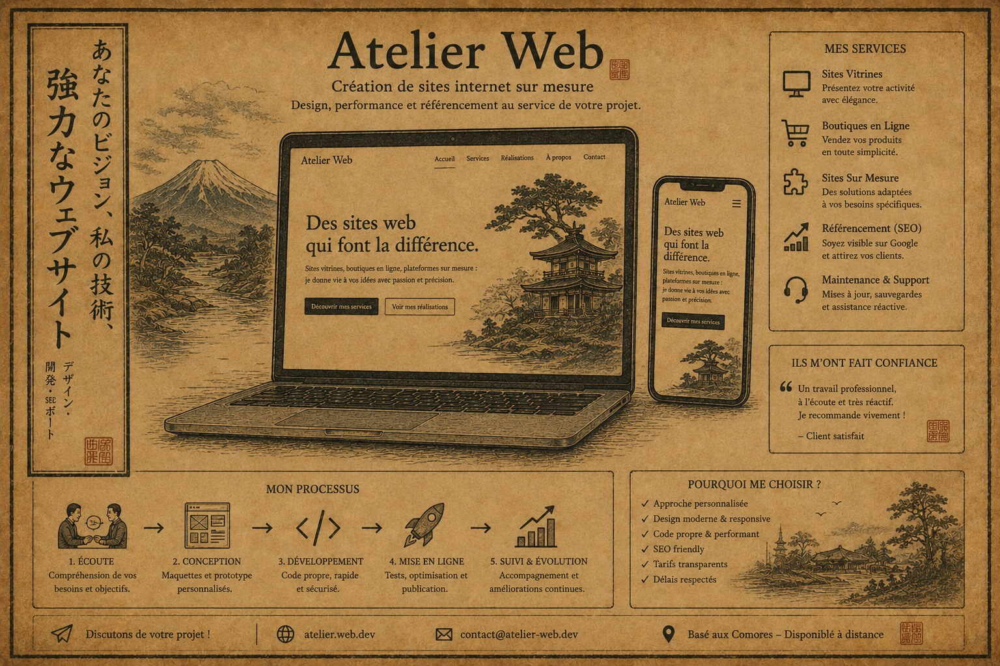

# Atelier Web

**Sites web faits main, rapides et sécurisés pour commerçants et artisans — Rillieux-la-Pape & Lyon.**

🌐 **Site en ligne : [duperopope.github.io](https://duperopope.github.io)**

## Le projet

Atelier Web est mon activité de création de sites internet pour les commerces locaux : vitrines, boutiques en ligne et sites sur mesure. L'approche est celle d'un artisan, pas d'une agence — code écrit à la main, zéro CMS lourd, des pages qui chargent vite et un référencement soigné.

- **Maquette gratuite, sans engagement** : le client voit son site avant de payer quoi que ce soit.
- **Performance** : HTML/CSS/JS statique, hébergement léger, scores Lighthouse au vert.
- **Sécurité** : formé en cybersécurité, je livre des sites sans surface d'attaque inutile.
- **SEO local** : structure sémantique, balises Open Graph, visibilité Google pour les commerces de proximité.

## Contenu du dépôt

| Chemin | Description |
|---|---|
| [`index.html`](index.html) | Page de service Atelier Web (offres, processus, contact) |
| [`paradis-de-la-coiffure/`](paradis-de-la-coiffure/) | Démo client : salon de coiffure à Rillieux-la-Pape — [voir en ligne](https://duperopope.github.io/paradis-de-la-coiffure/) |

## Réalisation livrée

➡️ **[constructioncomores.com](https://constructioncomores.com)** — site client livré, en ligne et référencé en tête des résultats Google (vitrine BTP aux Comores).

## Contact

**Samir Medjaher** — [CV interactif](https://duperopope.github.io/SamirMedjaher/) · [GitHub](https://github.com/Duperopope)
